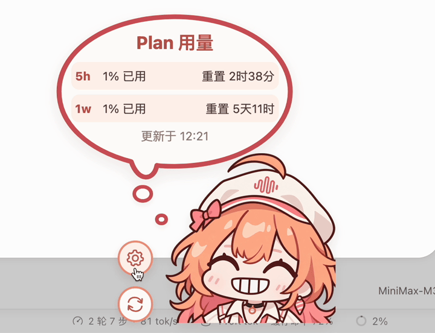
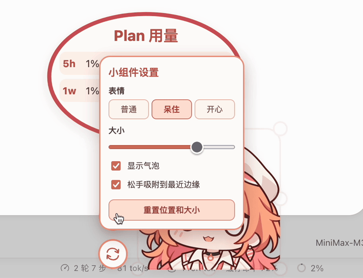

# MiniMax Plan 用量挂件

[](https://github.com/star-whisper9/dsh-minimax-plan-usage-widget/releases/latest)
[](https://github.com/deepseek-ai/deepseek-harness/releases/tag/dsh-v0.1.7-rc.2)

适用于 DeepSeek Harness Web 的 MiniMax 国内站 Token Plan 用量挂件，提供双周期用量展示、三种角色表情和弹性交互。



**[实机演示 →](docs/media/demo.mp4)**

## 功能

- **用量展示**：显示 `5h`、`1w` 已用百分比、重置倒计时和更新时间。
- **表情切换**：提供三种角色表情——小睦、呆傻、笑嘻了，支持手动选择。
- **拖拽与吸附**：拖动角色或气泡调整位置，可在松手后吸附到最近的窗口边缘。
- **等比例缩放**：悬停角色边缘显示缩放框，支持拖拽边框、角点或通过滑条调整大小。
- **弹性动效**：按压时挤压，松开后回弹；角色、气泡和文字同步变形，设置面板保持稳定。
- **自动 Q 弹**：可开启循环弹跳，按约 130 BPM 运行；播放音乐时小幅校准速度，保持动画流畅。
- **Q 弹音乐**：随交互播放。手动回弹保持固定动画，结束后音乐延续至下一拍并淡出；自动模式持续播放，关闭后在拍点收尾。
- **自动淡出**：鼠标离开 3 秒后逐渐降至 55% 不透明度，悬停时恢复完全不透明。

角色左下角提供**设置**和**手动刷新**按钮。设置支持气泡显隐、贴边吸附、自动 Q 弹和音乐开关；重置按钮同时重置位置、大小和音乐进度。自动 Q 弹与音乐默认关闭。



截图与录屏为早期版本，未展示新增的音乐和自动 Q 弹开关。

外观偏好、开关状态和音乐进度保存在当前浏览器中，不跨浏览器或访问地址同步。页面进入后台时暂停动画和音乐。浏览器可能阻止首次自动播放，按提示点击挂件即可重试。

## 适用范围

本插件仅查询 **MiniMax 国内站 Token Plan**，不提供账户余额或单次会话的 token 消耗统计。

已验证 DSH **`0.1.7-rc.2`**，要求 Node.js **22+**。其他 DSH 版本尚未验证，DSH 上游接口变化可能影响兼容性。

## 安装

以下命令以 `web` profile 为例。自定义部署需使用实际的 profile 名称，并确保安装与启动时的 `DSH_HOME` 一致。

### Release 安装包（推荐）

从 [Releases](https://github.com/star-whisper9/dsh-minimax-plan-usage-widget/releases) 下载目标版本的 `.tgz` 文件，然后执行以下命令（以 `0.1.1` 为例，请替换为实际文件名）：

```sh
dsh plugin --profile web add ./dsh-minimax-plan-usage-widget-0.1.1.tgz
```

此方式不需要克隆源码或执行构建。本项目暂不通过 npm registry 发布。

也可在 Web 侧栏选择 **插件 → 添加插件**，输入 `.tgz` 文件的绝对路径，安装后选择**立即启用**。远程部署时，文件和路径均应位于 DSH 服务端。

### 本地链接安装

适用于开发或自定义修改。在 macOS / Linux 终端执行：

```sh
git clone https://github.com/star-whisper9/dsh-minimax-plan-usage-widget.git
cd dsh-minimax-plan-usage-widget
dsh plugin --profile web add "link:$(pwd)"
```

其他终端可将 `link:$(pwd)` 替换为 `link:` 加项目绝对路径。DSH 直接读取链接目录，**安装后请勿移动或删除该目录**。本项目无需构建；修改前端文件后刷新页面，修改服务端代码后重启 DSH。

两种方式首次安装或升级后，均建议重启 DSH Web 并刷新页面。

### 卸载

```sh
dsh plugin --profile web remove dsh-minimax-plan-usage-widget
```

## 密钥来源

在 DSH 模型设置中，为内置 **MiniMax CN** 提供商（ID：`minimax-cn`）保存国内 Token Plan API Key。挂件自动复用该凭据，**无需单独配置密钥**，也不要求当前会话使用 MiniMax 模型。

凭据通过 DSH 服务读取，记录名为 `llm-pi-ai/minimax-cn`。用量查询在服务端完成，密钥不会传到挂件前端。

读取规则与兼容范围：

- 不自动发现自定义提供商、第三方适配器或中转服务的密钥。
- 未保存提供商密钥时，自动读取 DSH 命名凭据或服务端环境变量 `MINIMAX_CN_API_KEY`，无需额外配置。使用其他凭据名称时，可通过 `credentialRef` 指定；不会自动读取国际站的 `MINIMAX_API_KEY`。
- 已保存的提供商密钥优先于备用引用；密钥失效时应在 DSH 中更新。

`credentialRef` 仅填写凭据名称。请勿将 API Key 写入项目文件或提交到仓库。

## 致谢与许可

设计参考 [MeteorNOX / DeepSeek-Balance-Whale-Widget](https://github.com/MeteorNOX/DeepSeek-Balance-Whale-Widget)。本项目围绕 MiniMax Token Plan 独立实现，不包含参考项目的角色图片或音频。

角色素材由 AI 生成并经人工处理；气泡使用 SVG 绘制，文字使用 HTML 渲染。

Q 弹音乐提取自 [Bilibili 视频 BV1hXbN6VEKV](https://www.bilibili.com/video/BV1hXbN6VEKV/)，音频权利不包含在本项目的 Apache-2.0 许可中，详见 [NOTICE](NOTICE)。

项目采用 [Apache-2.0](LICENSE) 许可，相关声明见 [NOTICE](NOTICE)。MiniMax 名称、标识及基础角色形象的相关权利属于各自权利人；本项目与 MiniMax 官方无隶属关系，项目许可不代表获得第三方商标或角色授权。
